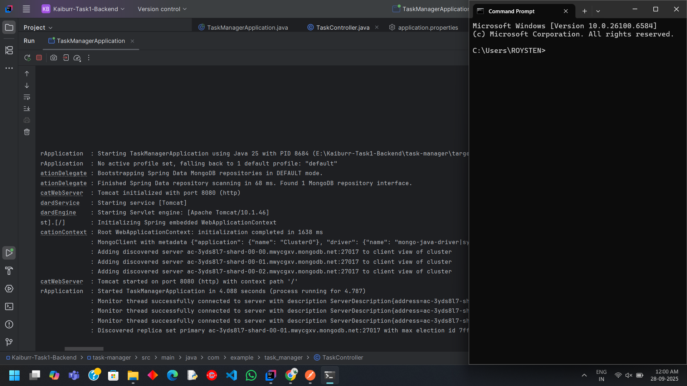
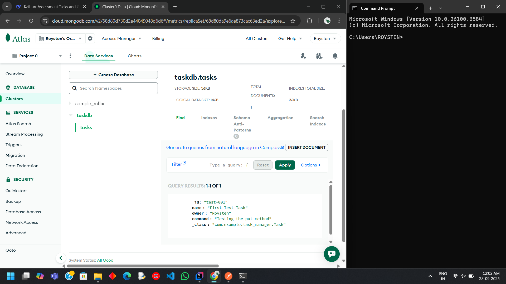
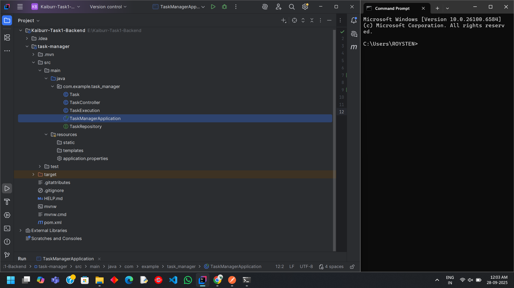
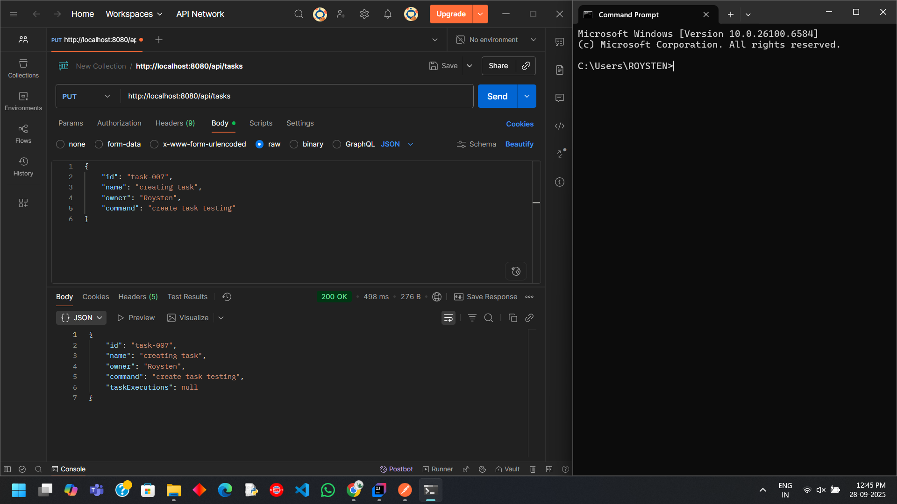
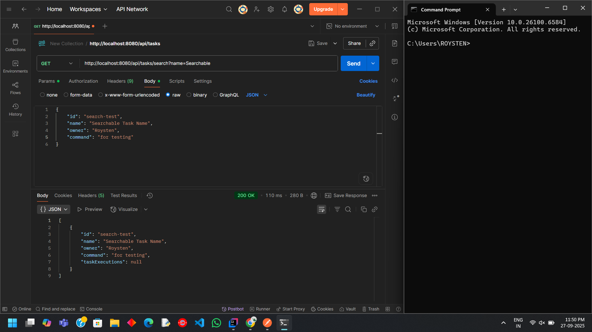
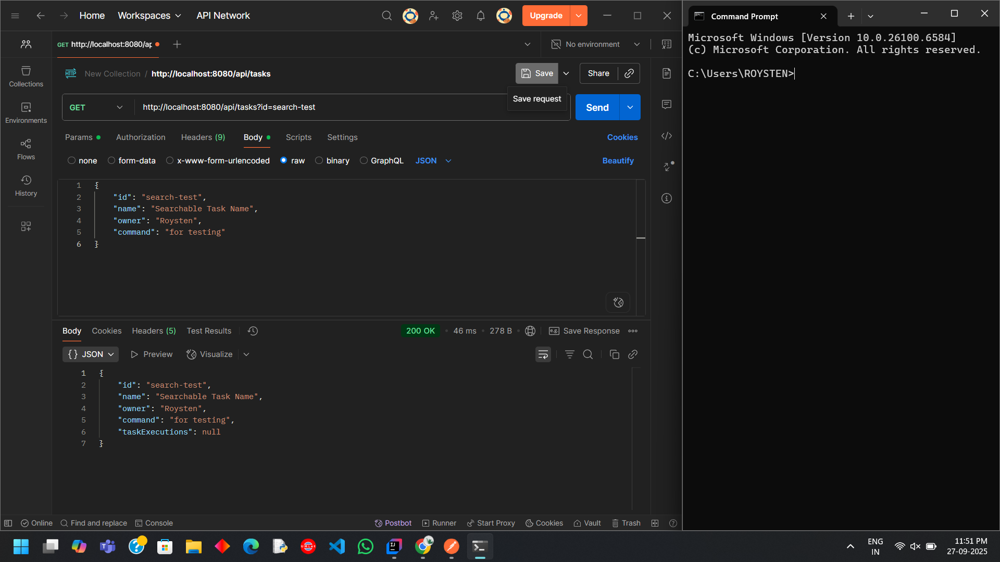

# Java Backend REST API

## Project Overview:
Spring Boot application providing REST API for task management with Mongo DB integration

## Technology and Tools:
- Java 25
- Spring Boot 3.5.6
- Mongo Atlas
- Maven
- Postman
- IntelliJ IDEA

## API Endpoints:
- PUT /api/tasks - Create a Task
- GET /api/tasks - Get all Tasks
- GET /api/tasks/search - Search Tasks by name and ID
- PUT /api/tasks/execute - Execute task command
- DELETE /api/tasks - Delete a task by ID

## Project Structure:
### src/main/java/com/example/taskmanager/
- |---- TaskManagerApplication.java
- |---- Task.java 
- |---- TaskExecution.java
- |---- TaskController.java
- |---- TaskRepository.java
- 
Application runs on: http://localhost:8080

### Applications runs successfully

### MongoDB Atlas cluster

### Project structure

## API Testing:
### Creating Task

### Get all Task

### Get Task by id and name

### Execute Task command

### Deleting a Task

